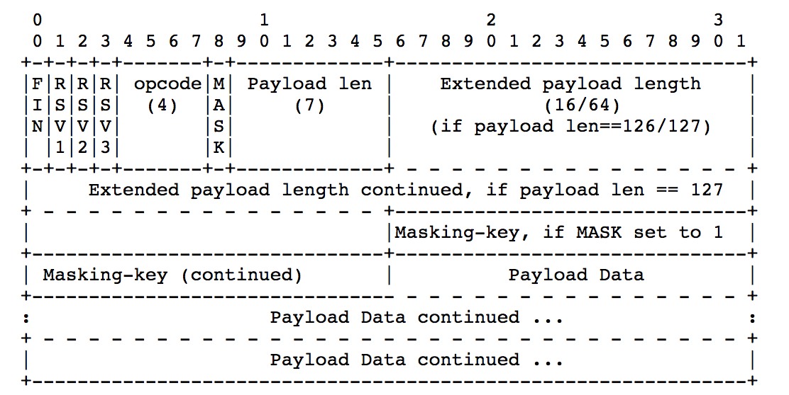

# OKHttp-WS-Wrapper

WS是独立的基于TCP协议的新的协议，它是全双工的工作方式。但是它的建立过程是依赖HTTP的，即握手建立连接是要通过Http协议，并由此升级为WS协议。

默认，对于`WS://`协议，它缺省使用80端口进行通信；`WSS://`协议,它缺省使用443端口进行通信。(请注意，它并非HTTP的增强协议~)

像IM、直播弹幕等都可以采用WS去实现。

## WS连接建立的过程

由于WS是基于TCP的，所以首先肯定有TCP的三次握手过程（这个是通用过程，不再细述~）。

然后就是建立WS连接，它是基于HTTP协议实现的，只需要一次握手即可。


主要就是2个步骤：

1. 客户端发送一个握手的包，握手包的报文其实就是HTTP的报文格式，具体的要求如下：

 * 必须是GET请求
 * HTTP版本 >= 1.1
 * 必须包含头部`Upgrade`，且值必须是websocket
 * 必须包含头部`Connection`，且值必须是Upgrade
 * 必须包含头部`Sec-WebSocket-Key`，值是一个Base64编码过的16字节随机字符串
 * 必须包含头部`Sec-WebSocket-Version`，且值必须是13

2. 服务端验证客户端的握手包规则后，就向客户端发送一个握手的确认包给客户端，具体的格式如下：
 
 * 返回的HTTP响应码必须是101
 * 必须包含头部`Connection`，且值必须是Upgrade
 * 必须包含头部`Upgrade`，且值必须是websocket
 * 必须包含头部`Sec-WebSocket-Accept`，它的值是通过如下算法计算得来：
  		* 将客户端头中的`Sec-WebSocket-Key`值和固定的字符串`258EAFA5-E914-47DA-95CA-C5AB0DC85B11`拼接起来
  		* 对拼接后的字符串进行一次SHA-1计算
  		* 将计算结果进行Base-64编码
3. 客户端在接收到服务端的返回，会对报文格式进行校验。任何一步的失败都将不能建立WS连接

PS：上面的流程可以看`OKHttpClient`类中的`newWebSocket()`方法。

## WS数据帧格式



* **FIN**： 1bit，标记当前数据帧是否是最后一个数据帧，一个消息可能是由多个数据帧来传递的
* **RSV1/RSV2/RSV3**：1bit，扩展保留项，默认为0
* **opcode**：4bit，操作码，描述数据帧的行为
 * 0x0：标记当前数据帧是一个消息的分片数据帧
 * 0x1：标记当前数据帧传递的内容是文本
 * 0x2：标记当前数据帧传递的内容是二进制
 * 0x8：标记当前数据帧是关闭连接的请求
 * 0x9：标记当前数据帧是PING的操作
 * 0xA：标记当前数据帧是PONG的操作，PONG是接到PING后的自动回应帧
* **MASK**：1bit，标记数据是否使用了掩码。如果使用了掩码，则这个值设置为1，如果设置了掩码，那么掩码的key保存在帧中的`Masking-key`字段中。需要注意的是**服务端发送的帧是不需要设置掩码的，但是客户端发送的帧就必须包含掩码。**
* **Payload len**：帧数据的长度，默认是7bit
 * 数据的长度小于126个字节，用默认的7bit来表示数据长度
 * 数据的长度等于126个字节，则用7+16bit来表示数据长度
 * 数据的长度大于126个字节，则用7+64bit来表示数据长度
* **Masking-key**：掩码key，如果MASK设置为0，则这个属性可忽略
* **Payload Data**：Payloa数据是由两部分数据组合而成，`Extension data`和`Application data`
 * `Extension data`默认情况下是空的，除非经过了协商使用了保留字段
 * `Application data`是协议里最后的部分，长度默认是等于`Payload len`

## okhttp-ws里的源码分析

### connect

连接的建立是客户端调用`OkHttpClient`里的`newWebSocket()`方法：

```java
@Override public WebSocket newWebSocket(Request request, WebSocketListener listener) {
    RealWebSocket webSocket = new RealWebSocket(request, listener, new Random());
    webSocket.connect(this);
    return webSocket;
  }
```

更细节的过程是（代码都是在`RealWebSocket`中）：

#### 1. 客户端生成`Sec-WebSocket-Key`

```java
byte[] nonce = new byte[16];
random.nextBytes(nonce);
this.key = ByteString.of(nonce).base64();
```

#### 2. 构建特殊的请求

如上面所述，WS的连接请求时比较特殊的

```java
client = client.newBuilder()
        .eventListener(EventListener.NONE)
        .protocols(ONLY_HTTP1)
        .build();
final int pingIntervalMillis = client.pingIntervalMillis();
final Request request = originalRequest.newBuilder()
        .header("Upgrade", "websocket")
        .header("Connection", "Upgrade")
        .header("Sec-WebSocket-Key", key)
        .header("Sec-WebSocket-Version", "13")
        .build();
```

需要注意的是，这里实际发出的是HTTP请求，为什么会这样呢？

这是因为在调用`Request`里的`url(*)`方法时，已经自动做了替换：

```java
public Builder url(String url) {
      if (url == null) throw new NullPointerException("url == null");

      // Silently replace web socket URLs with HTTP URLs.
      if (url.regionMatches(true, 0, "ws:", 0, 3)) {
        url = "http:" + url.substring(3);
      } else if (url.regionMatches(true, 0, "wss:", 0, 4)) {
        url = "https:" + url.substring(4);
      }

      HttpUrl parsed = HttpUrl.parse(url);
      if (parsed == null) throw new IllegalArgumentException("unexpected url: " + url);
      return url(parsed);
    }
```

所以可以看出WS虽然是全新的协议，但是还是和HTTP有一定的关系；同时在进行WS通信时，不一定要使用`ws://`或`wss://`。

#### 3. 接收到响应-格式检查

如上所述，响应也是必须满足一定格式，所以第一步就是格式的检查

```java
void checkResponse(Response response) throws ProtocolException {
    if (response.code() != 101) {
      throw new ProtocolException("Expected HTTP 101 response but was '"
          + response.code() + " " + response.message() + "'");
    }

    String headerConnection = response.header("Connection");
    if (!"Upgrade".equalsIgnoreCase(headerConnection)) {
      throw new ProtocolException("Expected 'Connection' header value 'Upgrade' but was '"
          + headerConnection + "'");
    }

    String headerUpgrade = response.header("Upgrade");
    if (!"websocket".equalsIgnoreCase(headerUpgrade)) {
      throw new ProtocolException(
          "Expected 'Upgrade' header value 'websocket' but was '" + headerUpgrade + "'");
    }

    String headerAccept = response.header("Sec-WebSocket-Accept");
    String acceptExpected = ByteString.encodeUtf8(key + WebSocketProtocol.ACCEPT_MAGIC)
        .sha1().base64();
    if (!acceptExpected.equals(headerAccept)) {
      throw new ProtocolException("Expected 'Sec-WebSocket-Accept' header value '"
          + acceptExpected + "' but was '" + headerAccept + "'");
    }
  }
```

#### 4. 接收到响应-WS数据收发的准备工作

这里主要是初始化输入输出的Source和Sink对象。


#### 5. 回调onOPen()方法

#### 6. 初始化消息操作的Reader和Writer

即初始化`WebSocketReader`和`WebSocketWriter`对象。在发送数据时将数据组织成帧，在接收数据时解析帧，同时处理WS的控制消息。

有了这2个能进行数据的发送和接收操作了。

```java
public void initReaderAndWriter(
      String name, long pingIntervalMillis, Streams streams) throws IOException {
    synchronized (this) {
      this.streams = streams;
      this.writer = new WebSocketWriter(streams.client, streams.sink, random);
      this.executor = new ScheduledThreadPoolExecutor(1, Util.threadFactory(name, false));
      if (pingIntervalMillis != 0) {
        executor.scheduleAtFixedRate(
            new PingRunnable(), pingIntervalMillis, pingIntervalMillis, MILLISECONDS);
      }
      if (!messageAndCloseQueue.isEmpty()) {
        runWriter(); // Send messages that were enqueued before we were connected.
      }
    }

    reader = new WebSocketReader(streams.client, streams.source, this);
  }
```

PS: 注意，这里会有个定时的ping事件。

####7. 关闭socket的超时时间

也就是阻塞通信的IO，不让其超时，因为WS必须保持连接一直存在。具体的代码

```java
streamAllocation.connection().socket().setSoTimeout(0);
```

#### 8. 进入消息循环读取

```java
public void loopReader() throws IOException {
    while (receivedCloseCode == -1) {
      // This method call results in one or more onRead* methods being called on this thread.
      reader.processNextFrame();
    }
  }
```

### read

上面详述了整个的WS连接建立的过程，那数据是怎么读取的呢？

首先接着上面的`processNextFrame()`：

```java
void processNextFrame() throws IOException {
    readHeader();
    if (isControlFrame) {
      readControlFrame();
    } else {
      readMessageFrame();
    }
  }
```

`readHeader()`主要就是解析WS协议了，具体的实现请看源码。

`readControlFrame()`是读取控制帧的数据，并给出相应的回调：

```java
private void readControlFrame() throws IOException {
    Buffer buffer = new Buffer();
    if (frameBytesRead < frameLength) {
      if (isClient) {
        source.readFully(buffer, frameLength);
      } else {
        while (frameBytesRead < frameLength) {
          int toRead = (int) Math.min(frameLength - frameBytesRead, maskBuffer.length);
          int read = source.read(maskBuffer, 0, toRead);
          if (read == -1) throw new EOFException();
          toggleMask(maskBuffer, read, maskKey, frameBytesRead);
          buffer.write(maskBuffer, 0, read);
          frameBytesRead += read;
        }
      }
    }

    switch (opcode) {
      case OPCODE_CONTROL_PING:
        frameCallback.onReadPing(buffer.readByteString());
        break;
      case OPCODE_CONTROL_PONG:
        frameCallback.onReadPong(buffer.readByteString());
        break;
      case OPCODE_CONTROL_CLOSE:
        int code = CLOSE_NO_STATUS_CODE;
        String reason = "";
        long bufferSize = buffer.size();
        if (bufferSize == 1) {
          throw new ProtocolException("Malformed close payload length of 1.");
        } else if (bufferSize != 0) {
          code = buffer.readShort();
          reason = buffer.readUtf8();
          String codeExceptionMessage = WebSocketProtocol.closeCodeExceptionMessage(code);
          if (codeExceptionMessage != null) throw new ProtocolException(codeExceptionMessage);
        }
        frameCallback.onReadClose(code, reason);
        closed = true;
        break;
      default:
        throw new ProtocolException("Unknown control opcode: " + toHexString(opcode));
    }
  }	
```

`readMessageFrame()`就是实际的读取WS的消息了，并作出对应的回调：

```java
private void readMessageFrame() throws IOException {
    int opcode = this.opcode;
    if (opcode != OPCODE_TEXT && opcode != OPCODE_BINARY) {
      throw new ProtocolException("Unknown opcode: " + toHexString(opcode));
    }

    Buffer message = new Buffer();
    readMessage(message);

    if (opcode == OPCODE_TEXT) {
      frameCallback.onReadMessage(message.readUtf8());
    } else {
      frameCallback.onReadMessage(message.readByteString());
    }
  }
```

### write/send

数据的发送主要是调用`WebSocket`接口里定义的`send(*)`方法，它的实现是在`RealWebSocket`。

```java
@Override public boolean send(String text) {
    if (text == null) throw new NullPointerException("text == null");
    return send(ByteString.encodeUtf8(text), OPCODE_TEXT);
  }

  @Override public boolean send(ByteString bytes) {
    if (bytes == null) throw new NullPointerException("bytes == null");
    return send(bytes, OPCODE_BINARY);
  }

  private synchronized boolean send(ByteString data, int formatOpcode) {
    // Don't send new frames after we've failed or enqueued a close frame.
    if (failed || enqueuedClose) return false;

    // If this frame overflows the buffer, reject it and close the web socket.
    if (queueSize + data.size() > MAX_QUEUE_SIZE) {
      close(CLOSE_CLIENT_GOING_AWAY, null);
      return false;
    }

    // Enqueue the message frame.
    queueSize += data.size();
    messageAndCloseQueue.add(new Message(formatOpcode, data));
    runWriter();
    return true;
  }
 
  // 消息如队列
  private void runWriter() {
    assert (Thread.holdsLock(this));

    if (executor != null) {
      executor.execute(writerRunnable);
    }
  }
```

可以看出，消息是进入消息队列的，并不是立即发送，然后调度writeRunnable执行真实的消息发送（消息会一直发送，直到成功）：

```java
this.writerRunnable = new Runnable() {
      @Override public void run() {
        try {
          while (writeOneFrame()) {
          }
        } catch (IOException e) {
          failWebSocket(e, null);
        }
      }
    };
```

消息包含了4个类型：

* PING消息
* PONG消息
* CLOSE消息
* Message


### keep alive

连接的保活主要是采用定时的PING和PONG。

如果设置了PING的执行周期，在握手的HTTP请求返回时，消息读取循环开始前会调度 PingRunnable 周期性的向服务器发送PING帧：

```java
if (pingIntervalMillis != 0) {
     executor.scheduleAtFixedRate(
            new PingRunnable(), pingIntervalMillis, pingIntervalMillis, MILLISECONDS);
}
```

然后实际的发送是在`WebSocketWriter`里，具体：

```java
void writePing(ByteString payload) throws IOException {
    writeControlFrame(OPCODE_CONTROL_PING, payload);
}  
```

WS通信的双方，任何一方接收到PING，都需要发出PONG消息作为响应。从上面的`readControlFrame()`可以看到。

```java
@Override public synchronized void onReadPing(ByteString payload) {
    // Don't respond to pings after we've failed or sent the close frame.
    if (failed || (enqueuedClose && messageAndCloseQueue.isEmpty())) return;

    pongQueue.add(payload);
    runWriter();
    pingCount++;
  }
```

### close

连接的关闭操作和发送消息类似（其实也是需要发送消息的~），也是调用调用WebSocket接口里定义的close()方法，它的实现是在RealWebSocket。

```java
synchronized boolean close(int code, String reason, long cancelAfterCloseMillis) {
    validateCloseCode(code);

    ByteString reasonBytes = null;
    if (reason != null) {
      reasonBytes = ByteString.encodeUtf8(reason);
      if (reasonBytes.size() > CLOSE_MESSAGE_MAX) {
        throw new IllegalArgumentException("reason.size() > " + CLOSE_MESSAGE_MAX + ": " + reason);
      }
    }

    if (failed || enqueuedClose) return false;

    // Immediately prevent further frames from being enqueued.
    enqueuedClose = true;

    // Enqueue the close frame.
    messageAndCloseQueue.add(new Close(code, reasonBytes, cancelAfterCloseMillis));
    runWriter();
    return true;
  }
```	

关闭的具体流程：

#### 1. Close code的有效性的检查

```java
static String closeCodeExceptionMessage(int code) {
    if (code < 1000 || code >= 5000) {
      return "Code must be in range [1000,5000): " + code;
    } else if ((code >= 1004 && code <= 1006) || (code >= 1012 && code <= 2999)) {
      return "Code " + code + " is reserved and may not be used.";
    } else {
      return null;
    }
  }
```

#### 2. 构造Close消息

构造Close消息，并加入到messageAndCloseQueue队列里，同时出发`runWriter()`。close消息可以带不超出123字节的字符串，以作为 Close message，来说明连接关闭的原因。

```java
void writeClose(int code, ByteString reason) throws IOException {
    ByteString payload = ByteString.EMPTY;
    if (code != 0 || reason != null) {
      if (code != 0) {
        validateCloseCode(code);
      }
      Buffer buffer = new Buffer();
      buffer.writeShort(code);
      if (reason != null) {
        buffer.write(reason);
      }
      payload = buffer.readByteString();
    }

    try {
      writeControlFrame(OPCODE_CONTROL_CLOSE, payload);
    } finally {
      writerClosed = true;
    }
  }
```

close操作分为**主动关闭**和**被动关闭**。客户端先向服务器发送一个CLOSE帧，然后服务器会回复一个CLOSE帧，对于客户端而言，这个过程为主动关闭；反之则为对客户端而言则为被动关闭。

对于主动关闭的，会得到一个close的回应帧，这个在`WebSocketReader`的 `readControlFrame()`中实现了解析，并且回调到了上层。

```java
try {
     listener.onClosing(this, code, reason);
     if (toClose != null) {
        listener.onClosed(this, code, reason);
     }
} finally {
     closeQuietly(toClose);
}
```

## WS交互的整个生命周期

1. 连接通过一个HTTP请求握手并建立连接。WebSocket 连接可以理解为是通过HTTP请求建立的普通TCP连接。
2. WebSocket 做了二进制分帧。WebSocket 连接中收发的数据以帧为单位。主要有用于连接保活的控制帧 PING 和 PONG，用于用户数据发送的 MESSAGE 帧，和用于关闭连接的控制帧 CLOSE。
3. 连接建立之后，通过 PING 帧和 PONG 帧做连接保活。
4. 一次 send 数据，被封为一个消息，通过一个或多个 MESSAGE帧进行发送。一个消息的帧和控制帧可以交叉发送，不同消息的帧之间不可以。
5. WebSocket 连接的两端相互发送一个 CLOSE 帧以最终关闭连接。
